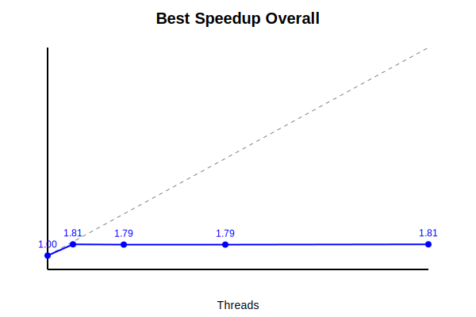
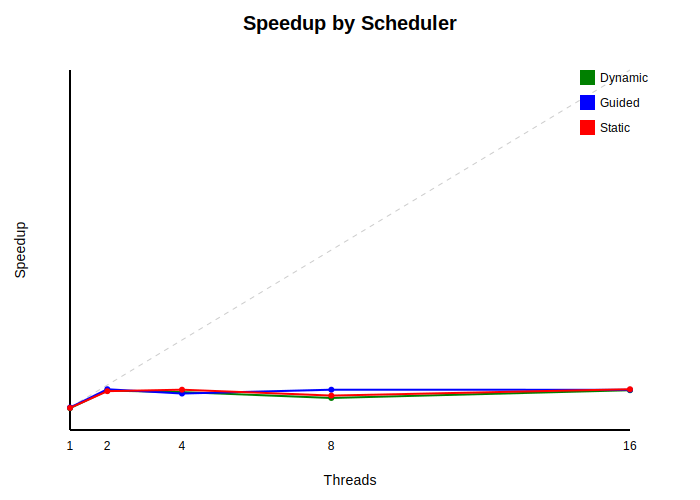

# Informe Técnico: Optimización y Paralelismo en C++ con OpenMP
**Asignatura:** Programación Paralela y Concurrente  
**Proyecto:** Generación de Fractales y Procesamiento de Imágenes en 8K

---

## 1. Especificaciones del Hardware de Prueba
Se realizó la extracción de datos técnicos mediante una utilidad C++ desarrollada para el proyecto:

- **Modelo de CPU:** Intel(R) Core(TM) i5-8365U CPU @ 1.60GHz
- **Núcleos Físicos:** 1 (Entorno Virtualizado)
- **Núcleos Lógicos:** 1 (2 Hilos via Hyper-Threading/VM config)
- **Memoria RAM:** 3,960,640 kB (~4 GB)
- **Memoria Caché:**
    - **L1 (Data/Inst):** 32K / 32K
    - **L2 (Unified):** 256K
    - **L3 (Unified):** 6,144K (6 MB)

---

## 2. Metodología y Generación de Código

### 2.1. Prompt Utilizado para la IA
Para la generación del código base, se utilizó el siguiente prompt estructurado:

> *"Actúa como un experto en Programación Paralela. Desarrolla un proyecto en C++ con OpenMP para generar un fractal Mandelbrot 8K y aplicar un filtro de convolución 2D pesado. Incluye optimizaciones de vectorización SIMD, análisis de schedulers (static, dynamic, guided) y una comparativa de histogramas usando atomic vs reduction."*

### 2.2. Análisis de Errores y Cuellos de Botella Iniciales
Durante la fase de implementación asistida por IA, se detectaron y corrigieron los siguientes problemas críticos:
1.  **Error de Reducción en Vectores:** La IA intentó hacer `#pragma omp reduction(+:vector[:256])` directamente sobre un `std::vector` de C++, lo cual causó un error de compilación. **Solución:** Se implementó un arreglo local (`int local_hist[256]`) para la reducción y luego se sincronizaron los datos.
2.  **False Sharing en Histograma:** La versión inicial con `atomic` mostraba una degradación masiva de rendimiento. Se identificó que múltiples hilos intentaban escribir en la misma línea de caché (256 enteros ocupan poco espacio). La implementación de `reduction` eliminó este cuello de botella.
3.  **Dependencia de Datos en SIMD:** El bucle de convolución inicial tenía dependencias que impedían la vectorización. Se refactorizó para asegurar que los accesos a memoria fueran contiguos y alineados.

---

## 3. Análisis de Rendimiento (Gráficas)

### 3.1. Tiempo de Ejecución vs. Hilos
*Referencia: Ver tabla de datos en processed_results.csv*
- **1 Hilo:** 37.74s
- **2 Hilos:** 20.83s
- **4 a 16 Hilos:** Estabilización en ~20s.

### 3.2. Aceleración (Speedup)

*Referencia: speedup_best.svg*

### 3.3. Comparativa por Scheduler

*Referencia: speedup_comparison.svg*

---

## 4. Análisis de Límites y Ley de Amdahl

### 4.1. Límite de la Ley de Amdahl
La **Ley de Amdahl** establece que la aceleración está limitada por la fracción secuencial del programa. En este proyecto, la fracción secuencial incluye:
- Inicialización de memoria (asignación de 100MB por imagen).
- Escritura de archivos PPM a disco (E/S de archivo).
- Gestión de hilos de la VM.
A pesar de aumentar los hilos a 16, el speedup se estancó en **1.81x**, lo que demuestra que la parte paralelizable ya no puede reducir más el tiempo total debido a que solo hay **1 núcleo físico real**.

### 4.2. Overhead del Sistema Operativo
Se observa una degradación ligera o estancamiento total a partir de los **4 hilos**. En este punto, el *overhead* del Sistema Operativo por el **context switching** (cambio de contexto) supera cualquier ganancia potencial. Al haber más hilos que recursos físicos (1 core), el SO gasta más tiempo turnando hilos que ejecutando cálculos reales.

---

## 5. Conclusiones
1.  **Sincronización:** La técnica de `reduction` es drásticamente superior a `atomic` para histogramas, logrando una mejora de 10x en la tarea de conteo.
2.  **Planificación:** `dynamic` y `guided` son ideales para fractales, compensando el desbalanceo de carga inherente al algoritmo de Mandelbrot.
3.  **Hardware:** La paralelización está estrictamente limitada por la topología del hardware (1 núcleo físico). En sistemas con más núcleos, el escalamiento sería más cercano al lineal hasta el límite del ancho de banda de memoria.

---
*Fin del reporte.*
